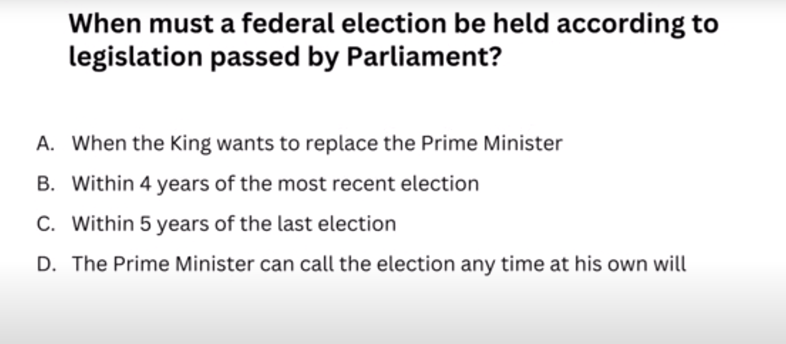
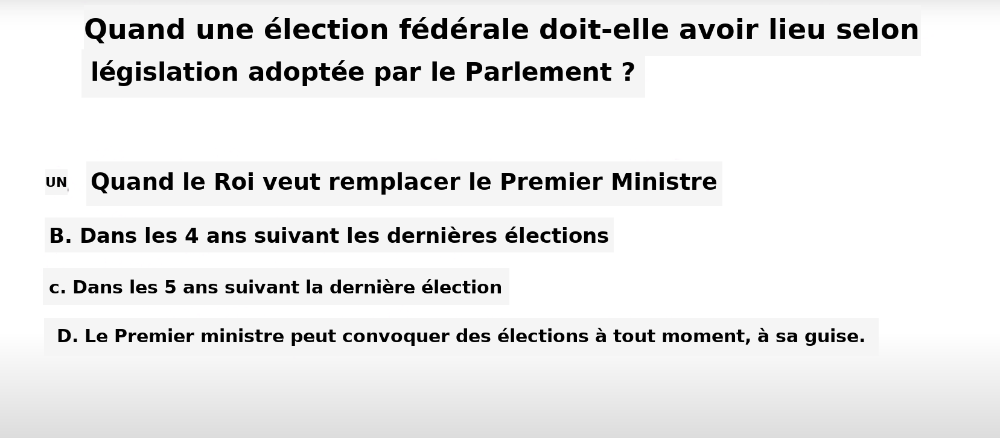

# Image Translator

This project utilizes optical character recognition (OCR) and translation to translate text within images from one language to another. It performs the following steps:

1. **OCR Processing:** The project extracts text and its bounding boxes from input images using the EasyOCR library.
2. **Translation:** It translates the extracted text using the Google Translator API.
3. **Text Replacement:** The translated text is then overlaid onto the image, replacing the original text while maintaining its position and style.
4. **Output:** Finally, the modified image with translated text is saved to an output folder.


## Usage

1. Place your input images in the `input` folder.
2. Run the script `main.py`.
3. Translated images will be saved in the `output` folder.

## New Features

### SyncVideoToAudio.py
This script syncs audio to a video file using advanced checks and features. It performs the following steps:
- **Duration Check:** Ensures that the video and audio durations are within a specified tolerance.
- **Audio Extraction:** Extracts audio from the video if available, or generates silent audio if not.
- **Audio Alignment:** Aligns the audio using cross-correlation to calculate the offset.
- **Synchronization:** Syncs the audio to the video using FFmpeg and saves the output.

### MultipleImageProcessing.py
This script processes multiple images by performing OCR to extract text, translating the text, and replacing the original text in the images with the translated text. It includes:
- **Batch Processing:** Allows processing images one by one or multiple images simultaneously using multithreading.
- **Error Handling:** Handles translation errors and missing translations gracefully.
- **Customization:** Supports custom source and target languages for OCR and translation.

### videoToImage.py
This script extracts frames from a video file and saves them as individual images. It features:
- **Frame Extraction:** Reads and saves each frame of the video as a separate image.
- **Output Management:** Ensures the output folder exists and manages the file naming for the frames.

### imageToVideo.py
This script converts a series of images into a video file. It includes:
- **Image-to-Video Conversion:** Reads images from a folder and combines them into a video file.
- **Frame Rate Customization:** Allows setting the frame rate for the output video.
- **Error Handling:** Uses a placeholder frame for any invalid or unreadable images.

## The goal of this update is to be able to translate video to video with the combination of [OpenTranslator](https://github.com/overcrash66/OpenTranslator).

# Setup

## Installation

Clone this repository to your local machine.

```
Install the required Python dependencies using pip install pipenv && pipenv install.
```

or

```
py -3.10 -m venv venv
venv\Scripts\activate
pip install -r requirements.txt
```

If you like to use torch with cuda:

```
pip uninstall torch torchvision
pip install torch==2.5.1+cu118 torchaudio==2.5.1+cu118 torchvision==0.20.1+cu118 --index-url https://download.pytorch.org/whl/cu118
```

## Notes

-   Supported languages for OCR can be seen [here](https://www.jaided.ai/easyocr/)
-   Supported languages for Google Translate can be obtained using the following code:
    ```python
    from deep_translator.constants import GOOGLE_LANGUAGES_TO_CODES
    print(GOOGLE_LANGUAGES_TO_CODES)
    ```
-   Adjustments to text languages, recognition thresholds, translation services, or image processing parameters can be made within the script.

## Examples




## Acknowledgments

-   [EasyOCR](https://github.com/JaidedAI/EasyOCR) - For OCR processing.
-   [Google Translator](https://pypi.org/project/deep-translator/) - For text translation.
-   [Pillow (PIL Fork)](https://python-pillow.org/) - For image manipulation.